# ESP32 LED Matrix Clock

A desk clock built on an ESP32 with a red 32×8 LED dot-matrix display, housed in a glossy black acrylic case. Time is kept by a battery-backed RTC and corrected over WiFi with NTP, so the clock keeps running even when the network is down.

<!-- Replace with a photo of the finished clock: docs/images/clock.jpg -->


## Features

- **Four modes**, switched with two touch pads: clock → date → stopwatch → alarm
- **Rolling digits**: every digit that changes scrolls up into place, 8 steps over 400 ms
- **Thai time (UTC+7)** from a DS1302 RTC with a CR2032 backup battery, so time survives unplugging
- **NTP sync** over WiFi every hour; works offline and the time can be set by hand
- **WiFi setup** over SoftAP provisioning, no credentials hard-coded in firmware
- **Alarm** with a passive buzzer, **night mode** that dims the display on a schedule
- Single USB-C cable for power and firmware upload

## Hardware

| Image | Part | Qty | Notes |
|---|---|---|---|
| 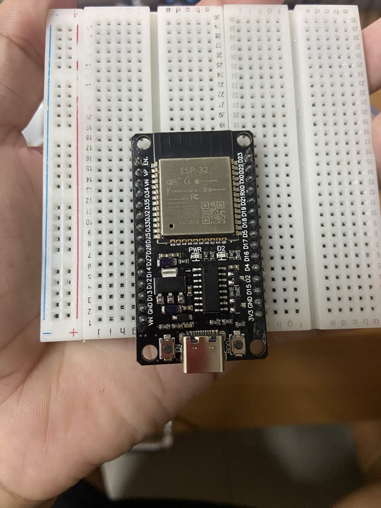 | ESP32 DevKit V1 (30-pin) | 1 | USB-C variant; powers everything from USB |
| 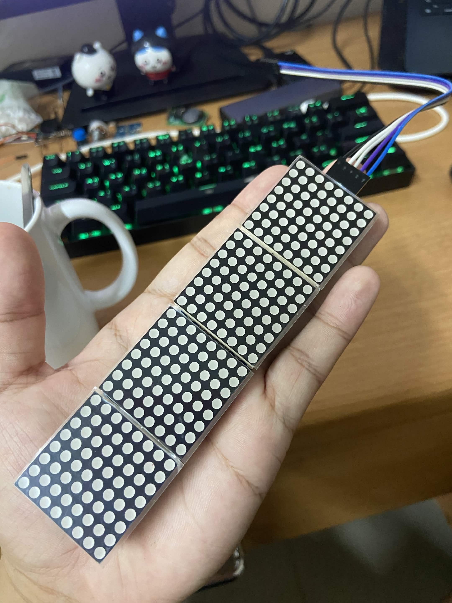 | MAX7219 4-in-1 LED matrix (32×8, FC-16 style) | 1 | Red LEDs, powered from VIN (5V) |
| 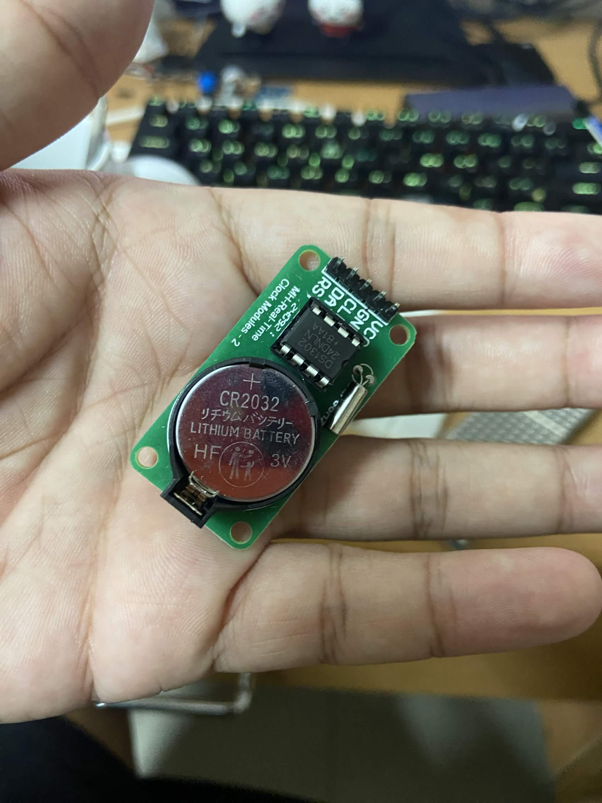 | DS1302 RTC module + CR2032 coin cell | 1 | 3-wire interface at 3.3V; the module has no charging circuit |
| 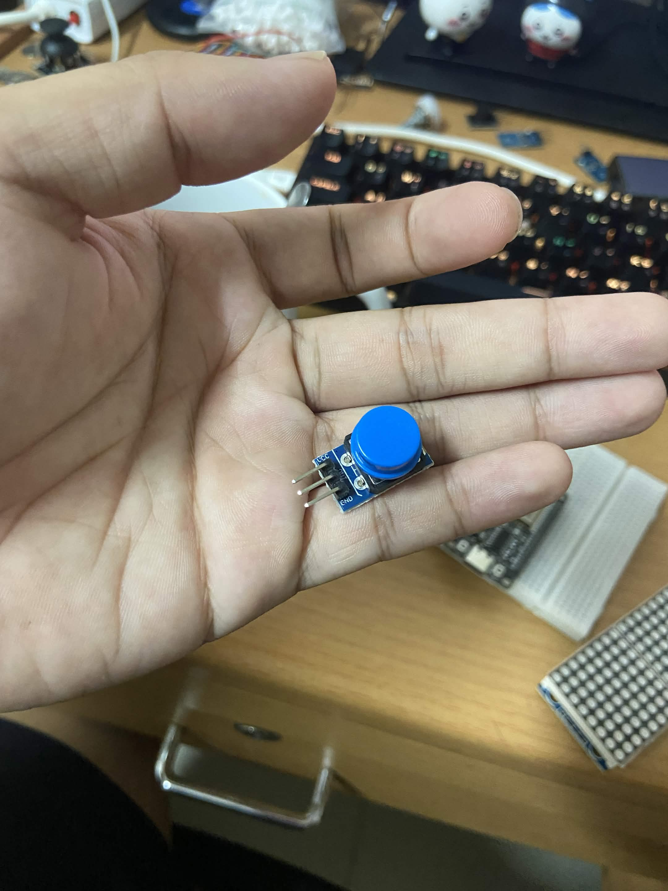 | Push button module | 1 | Enter / select |
| 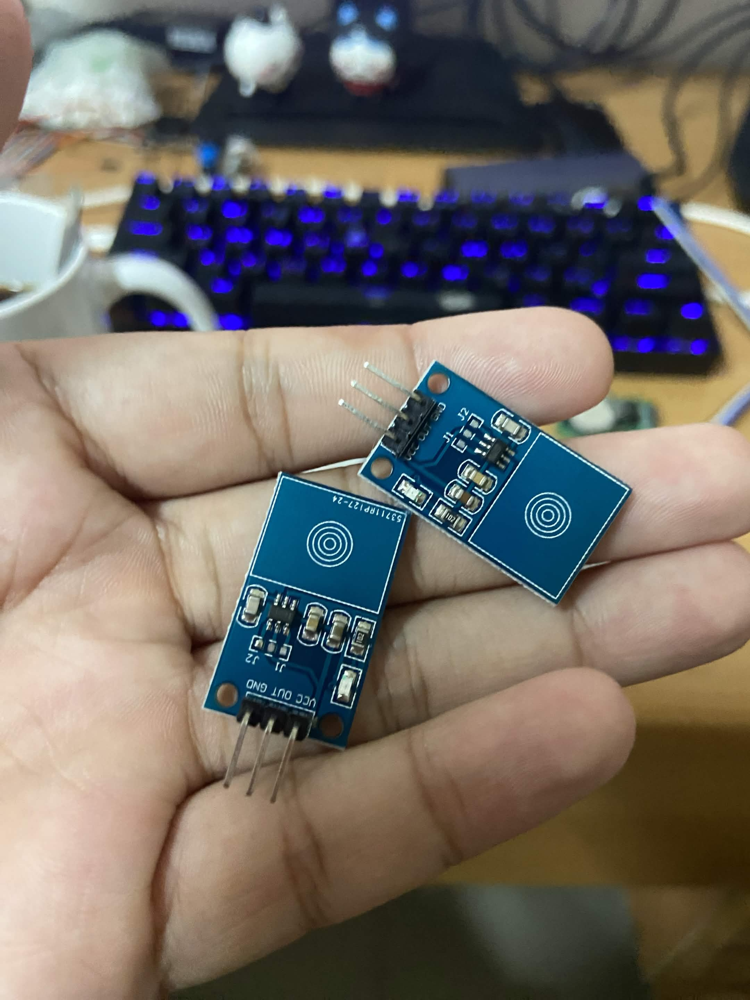 | TTP223 capacitive touch sensor | 2 | Previous / next; works through thin acrylic |
| 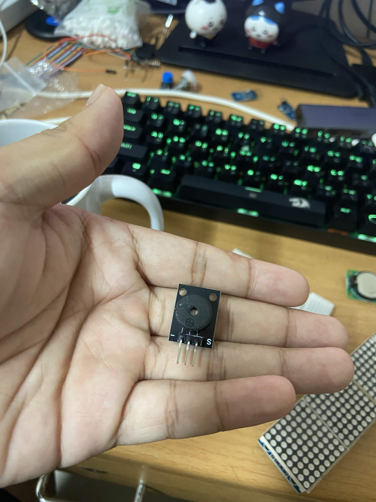 | Passive buzzer module | 1 | Driven by LEDC PWM for beeps and the alarm |
|  | 5V USB adapter (≥ 1 A) + USB-C cable | 1 | |
|  | Black acrylic enclosure | 1 | Touch pads and button on the side, USB-C on the back |
| 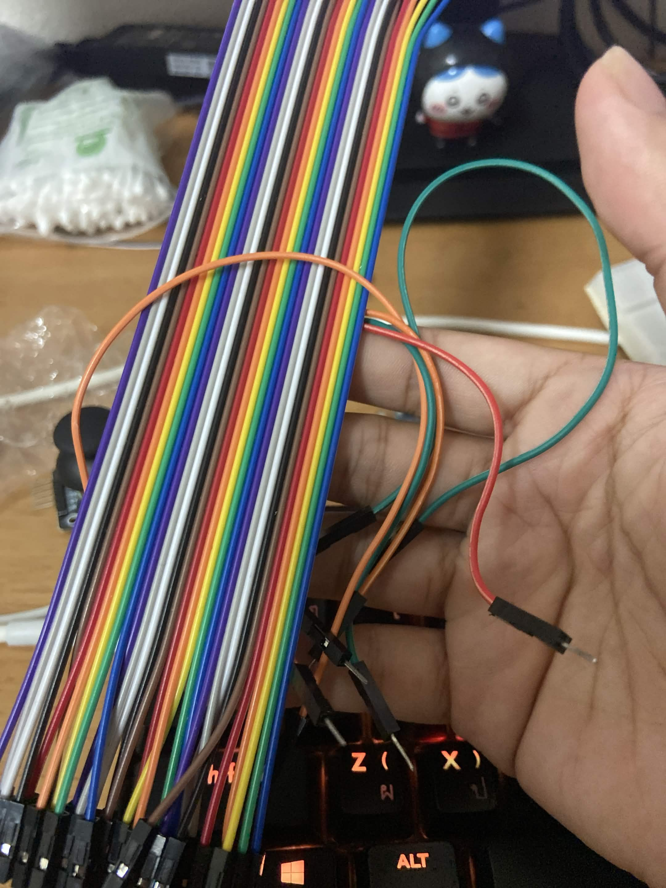 | Jumper wires | — | Female–female |

To use real photos, put them in `docs/images/` and replace each `src` with the local path, e.g. `docs/images/max7219.jpg`.

## Wiring

| Device | Module pin | ESP32 pin | Power |
|---|---|---|---|
| MAX7219 matrix | DIN / CLK / CS | GPIO23 / GPIO18 / GPIO5 (VSPI) | VIN (5V) |
| DS1302 RTC | CLK / DAT / RST | GPIO14 / GPIO27 / GPIO26 | 3V3 |
| Push button | OUT | GPIO25 | 3V3 |
| Touch T1 (previous) | OUT | GPIO32 | 3V3 |
| Touch T2 (next) | OUT | GPIO33 | 3V3 |
| Passive buzzer | S | GPIO19 | 3V3 |

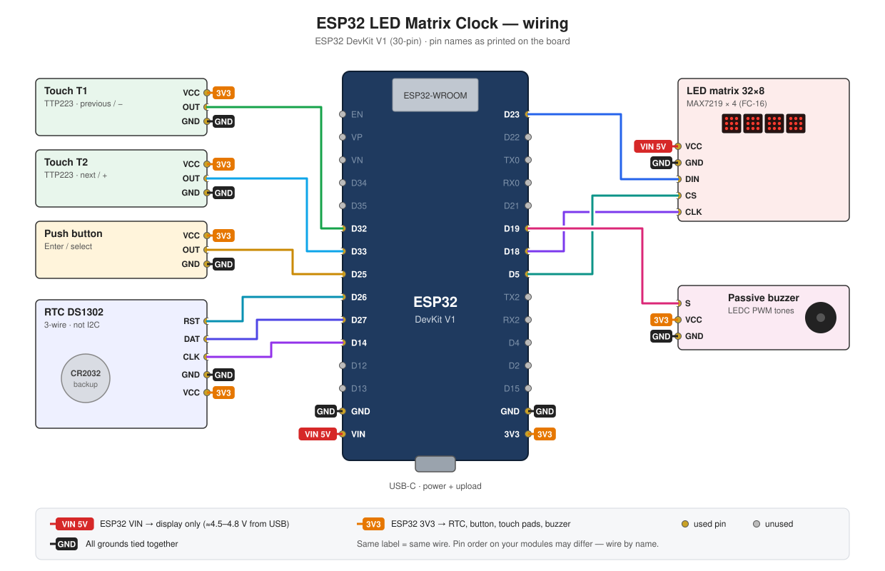

Notes:

- Only the display runs on 5V. Every module that sends a signal back to the ESP32 runs on 3.3V.
- Avoid GPIO6–11 (flash) and GPIO12 (strapping pin). GPIO5 is also a strapping pin but is safe as CS because it idles high.
- Spare pins: GPIO4, 13, 16, 17.
- Display brightness is capped at 8/15 to keep current within what the VIN diode can supply.
- With USB plugged in, VIN should read at least 4.5V.

## Controls

| Input | Main screens | In the settings menu |
|---|---|---|
| T1 | Previous mode | Decrease value |
| T2 | Next mode | Increase value (hold to repeat) |
| Button, short press | Enter (see below) | Confirm, go to next field |
| Button, hold 3 s | Open settings menu (beep) | Cancel without saving |
| Button held while powering on | WiFi setup (two beeps) | — |
| Any input while alarm rings | Stop the alarm | — |

| Mode | Short press on the button |
|---|---|
| Clock | Show `ONLINE` / `OFFLINE` for 2 s |
| Date | — |
| Stopwatch | Start / stop |
| Alarm | Turn alarm on / off |

Settings menu: time, date, alarm time, 12/24 h, night mode schedule, brightness.

## Display layout

The clock screen fits `HH:MM` in 4×7 digits plus seconds in 3×5 digits on the 32×8 matrix:

```
col: 0   3 5   8  10 12  15 17  20  22 24 26 28 30 31
     [ H ] [ H ]  :  [ M ] [ M ]  .  [s] [s]       *
```

- Column 31 holds status dots: top = alarm armed, bottom = offline.
- The date screen scrolls continuously, e.g. `FRI 2/10/26`.
- Mode labels (`CLK`, `DATE`, `STW`, `ALM`) show for 0.8 s when switching modes.

## Software

| | |
|---|---|
| Build system | [PlatformIO](https://platformio.org/), `platform = espressif32 @ 7.1.0` |
| Framework | ESP-IDF 6.1.0 |
| Board | `esp32doit-devkit-v1` |
| Components | [`esp-idf-lib/max7219`](https://components.espressif.com/components/esp-idf-lib/max7219), [`esp-idf-lib/ds1302`](https://components.espressif.com/components/esp-idf-lib/ds1302), [`espressif/button`](https://components.espressif.com/components/espressif/button), [`espressif/network_provisioning`](https://components.espressif.com/components/espressif/network_provisioning) |

### Project structure

```
components/
├── board/         GPIO map and hardware constants (header only)
├── display/       MAX7219 driver wrapper, 32×8 framebuffer, fonts, glyph drawing
├── rtc/           DS1302 wrapper: read/write time, validity check
├── timekeeping/   System time: RTC ↔ system clock, time zone
├── input/         Touch pads and button → input events
├── buzzer/        LEDC tones: beeps and alarm
├── settings/      NVS-backed user settings
├── net/           WiFi, provisioning, SNTP, network state machine
└── ui/            UI state machine, screens, animations
src/main.c         Initialises everything and starts the tasks
```

### Module dependencies

Lower layers never depend on higher ones. `input` and `net` report events; only `ui` knows the full picture.

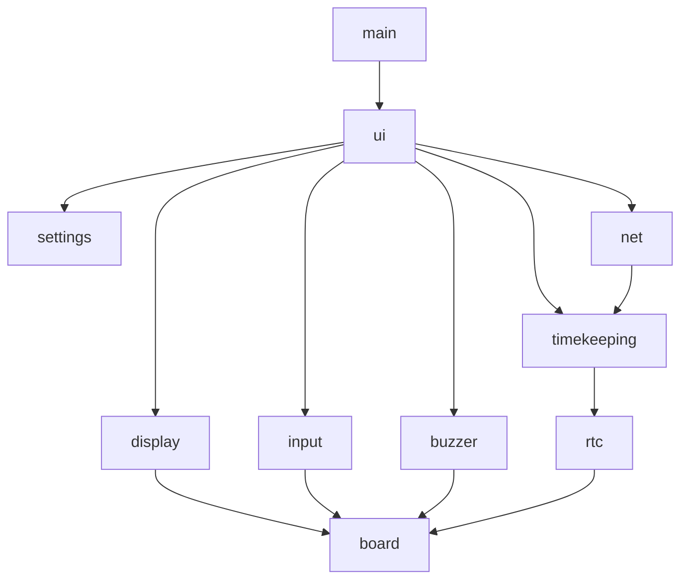

### Boot flow

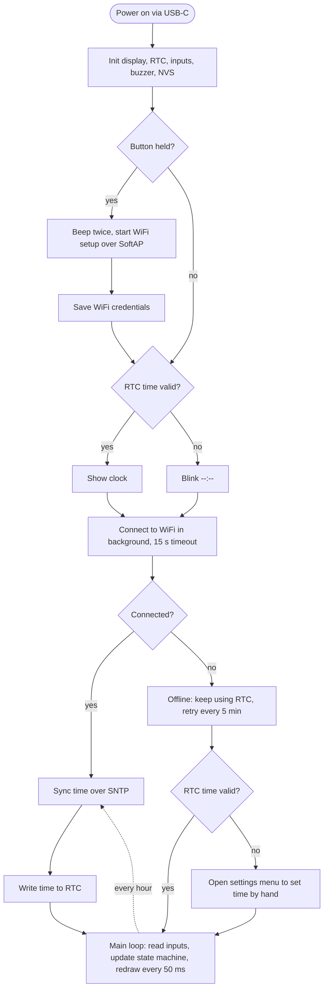

### UI state machine

Runs in the `ui` task every 50 ms. T1 moves through the modes in the opposite direction to T2.

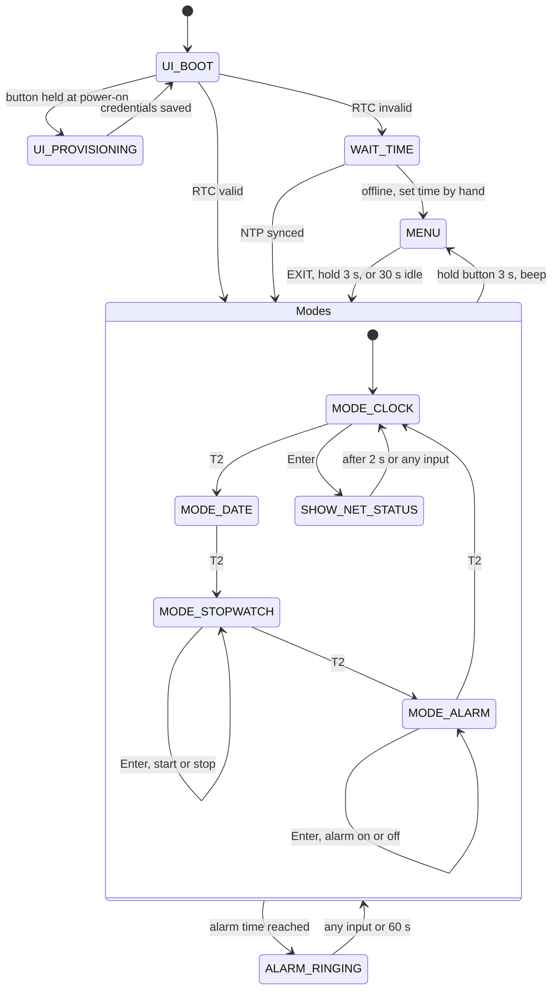

### Network state machine

Runs in the `net` task so connecting to WiFi never blocks the display.

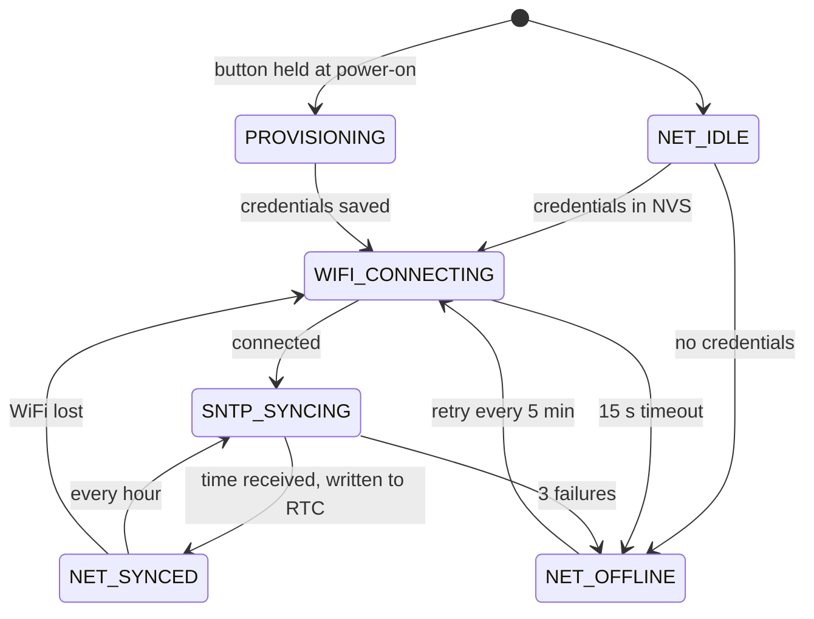

## Getting started

### Prerequisites

- [VS Code](https://code.visualstudio.com/) with the PlatformIO IDE extension
- The project path must not contain spaces (an ESP-IDF build system limitation)

### Build and flash

```bash
git clone https://github.com/Doonminus2/Esp-32-Clock-Device.git
cd Esp-32-Clock-Device
pio run                      # first build downloads the toolchain and components
pio run -t upload            # flash over USB
pio device monitor           # serial log at 115200 baud
```

If `pio` is not found, add PlatformIO to your PATH:

```bash
echo 'export PATH="$PATH:$HOME/.platformio/penv/bin"' >> ~/.zshrc
source ~/.zshrc
```

### Editor setup (clangd)

```bash
pio run -t compiledb         # generates compile_commands.json
```

Then restart the clangd language server. Re-run `compiledb` whenever you add source files or components.

### Configuration notes

- Put custom Kconfig values in `sdkconfig.defaults`. The generated `sdkconfig.esp32doit-devkit-v1` is not committed.
- `dependencies.lock` is committed so component versions stay fixed.

## Roadmap

- [x] PlatformIO + ESP-IDF 6.1 project setup with components
- [ ] `board`: central GPIO map
- [ ] `display`: framebuffer, fonts, clock layout
- [ ] `display`: rolling-digit animation
- [ ] `rtc` + `timekeeping`: read/write DS1302, survive power loss
- [ ] `input`: touch and button events
- [ ] `buzzer`: beep patterns
- [ ] `ui`: clock, date, settings menu (fully usable offline clock)
- [ ] `net`: SNTP sync and WiFi provisioning
- [ ] `ui`: stopwatch and alarm, `settings` in NVS

## Acknowledgements

The rolling-digit effect was inspired by schreibfaul1's [LED Matrix Clock](https://github.com/schreibfaul1/ESP32-LED-Matrix-Clock). This project is an independent ESP-IDF implementation and shares no code with it.