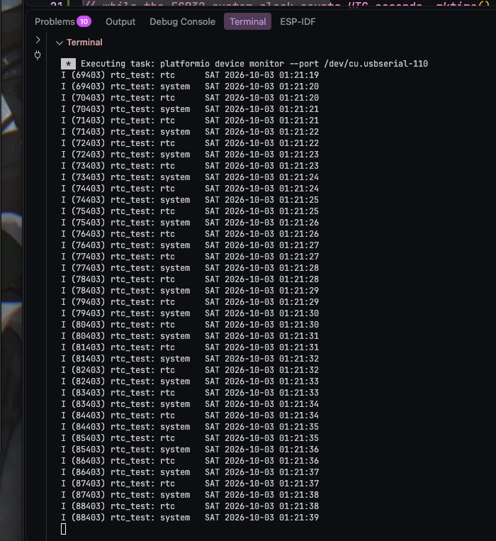

วันแรกเวลาตี 1 กว่าของวันที่ 3/10/2026

ผมได้่เขียนฟังชั่น sync เวลาในเครื่อง Macbook ผมกับตัวโมดูล RTC ปัญหาทีี่เจอตามในภาพคือเวลาในเครืองผมมันเร็วกว่า RTC อยู่ 1 วิ ซึ่งปัญหานี้มันเจอได้การเขียน code แบบ line-by-line ผมให้ผมต้องใช้ freertos ในการเรียน current ช่วยให้ sync เวลาได้่ตรงมากขึ้นในไฟล์ components ของ timkeeping 

